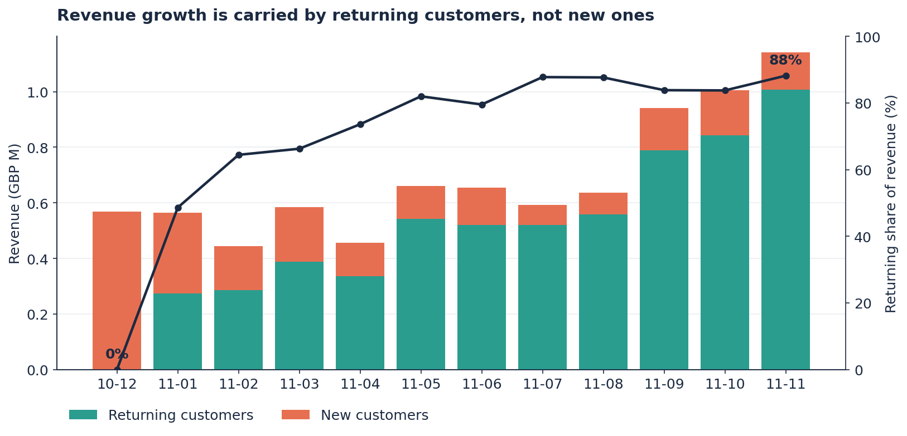
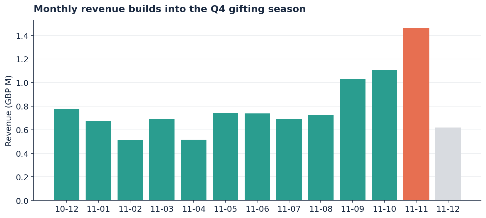
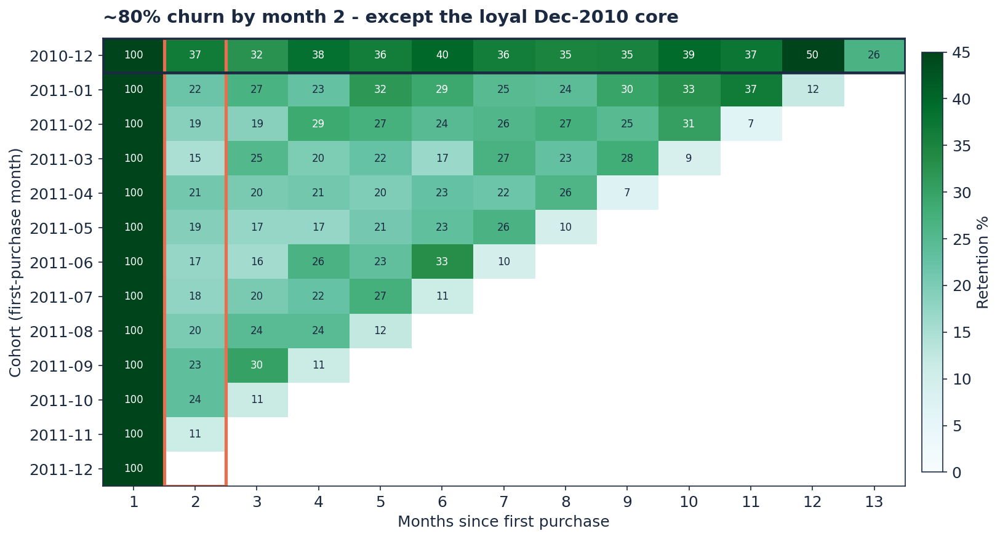
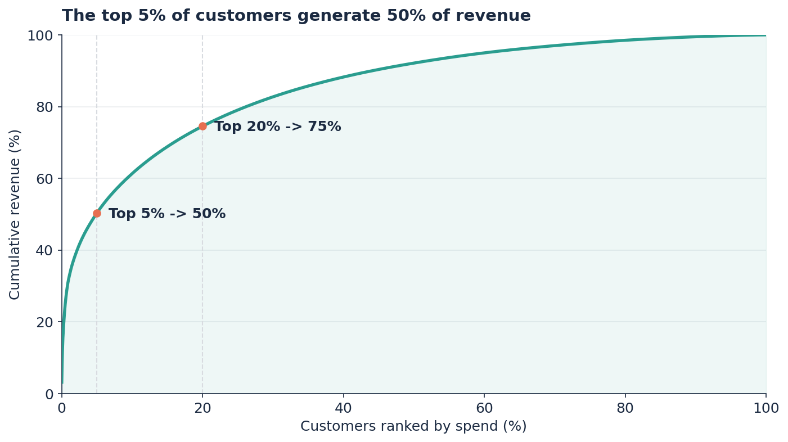
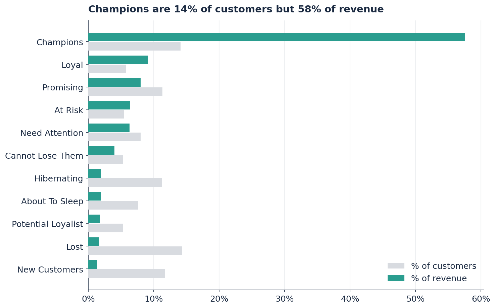
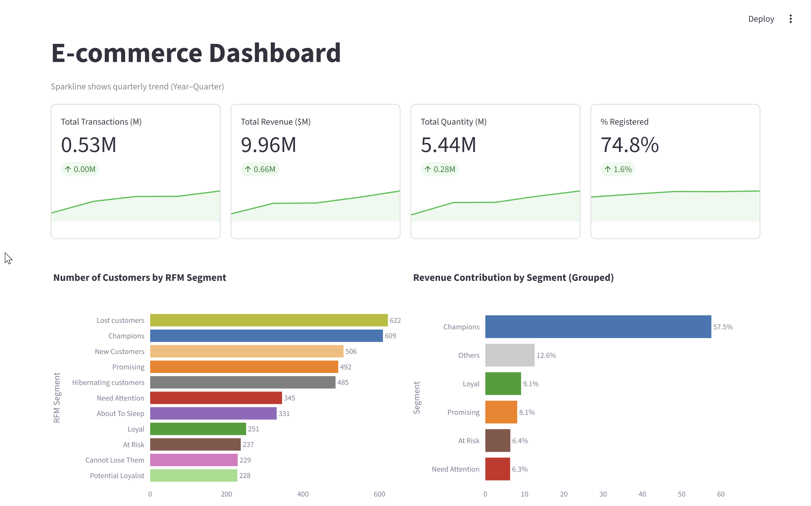
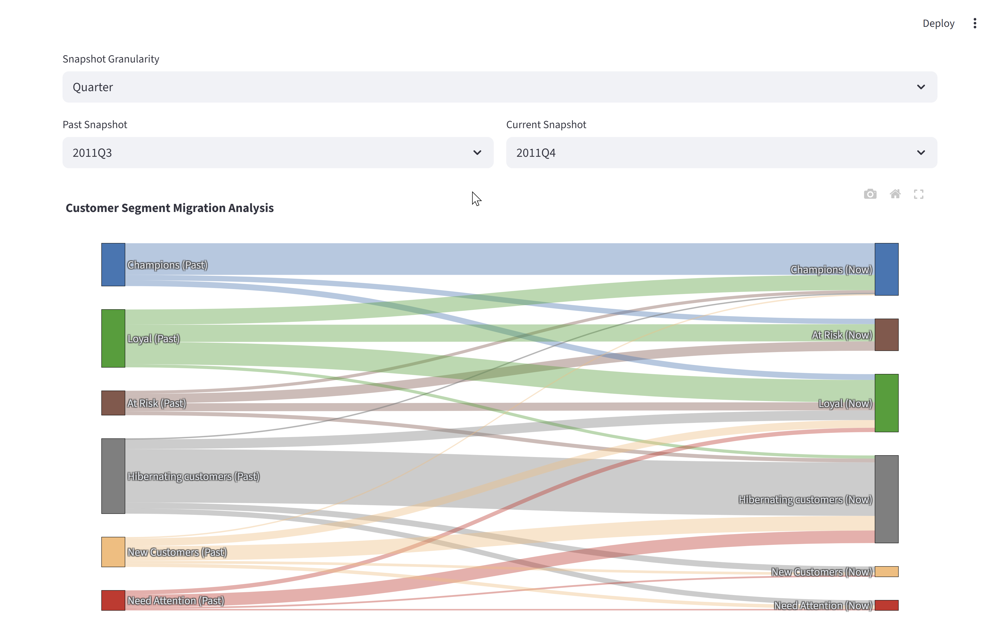

# Customer Lifetime & Retention Analysis — UK Gift E-commerce

> A loyal core is masking a leaky acquisition funnel: 88% of revenue now comes from returning customers, while ~80% of every new cohort disappears by month two.


---



---

## Key Takeaways

- **The top 5% of customers generate ~50% of revenue**, and Champions — 14% of customers — drive 58%. Revenue rests on a small, loyal core.
- **~80% of every new customer cohort churns by month 2.** The acquisition funnel leaks badly and the drop-off is systematic, not random.
- **Returning-customer revenue share rose from 49% to 88% over the year.** Reported growth is the loyal base compounding, not new customers arriving.

---

## Business Context

The business is a UK-based online retailer of all-occasion giftware, selling both to individual shoppers and to a large base of small-business wholesale buyers. Over the 12 months analysed, top-line revenue looked healthy and climbed steadily into the Q4 gifting season, peaking in November at 1.8× the monthly average.

That headline growth hid a question the marketing team could not answer from a revenue chart alone: *is the customer base actually getting stronger, or is a shrinking group of loyal buyers papering over a retention problem?* If growth depends on customers who were acquired long ago, then a good-looking quarter can mask a pipeline that has quietly stopped refilling — and by the time that shows up in revenue, it is expensive to fix.

---

## Business Questions

1. Is revenue growth driven by **new customers** or by the **existing base**?
2. **Where** in the customer lifecycle do buyers drop off?
3. How **concentrated** is revenue across the customer base?
4. Which customer **segments** deserve the marketing budget, and for what goal?
5. What is the **real risk** hiding behind healthy top-line numbers?

---

## Dataset Overview

| Attribute | Detail |
|---|---|
| **Source** | [UCI Machine Learning Repository — *Online Retail*](https://archive.ics.uci.edu/dataset/352/online+retail) (public) |
| **Period** | 2010-12 to 2011-12 (~12 months) |
| **Records** | 530,210 clean transaction lines (from 541,909 raw) |
| **Customers** | 4,335 registered + guest checkouts |
| **Grain** | 1 row = 1 product line within an invoice |

> The full dataset (~47 MB, public — UCI *Online Retail*) is included in [`data/`](data/), and field definitions are in [`data_dictionary.md`](data_dictionary.md). The notebook and dashboard run on it directly, so every figure in this README is reproducible.

---

## Analysis Approach

```
Raw CSV  →  Cleaning (pandas)  →  RFM segmentation  →  Cohort retention  →  New-vs-returning split
```

- **Cleaning** — remove cancellations, keep real product lines, separate guests from registered customers.
- **RFM segmentation** — score every registered customer on Recency, Frequency, Monetary and map them to 11 named segments (Champions, Loyal, At Risk, …).
- **Cohort retention** — group customers by first-purchase month and track how many return each following month.
- **New-vs-returning revenue** — split each month's revenue into first-time and returning customers to see what is really driving growth.



---

## Key Findings

### Finding 1 — Growth is returning-customer growth, not acquisition


Splitting monthly revenue by customer tenure reverses the obvious "growing business" reading. New-customer revenue share falls from 51% in January to 12% in November, while returning customers climb to 88% of the total. The strong Q4 — including the November peak — is overwhelmingly the existing base buying again for the holidays, not a wave of new customers. Growth is real, but it is **concentration deepening**, not the funnel widening.

---

### Finding 2 — ~80% of each cohort is gone by month 2 — except one



Every monthly cohort loses roughly 80% of its customers by the second month (average month-2 retention 20%). The striking exception is the **December 2010 cohort**, which holds 35–50% retention across the entire year and even rebounds to 50% at month 12. That first cohort behaves like a true wholesale base; later 2011 cohorts increasingly do not. The retention curve is smooth and repeatable, which means the drop-off is a fixable onboarding problem, not random noise.

---

### Finding 3 — Half of revenue comes from the top 5% of customers



Revenue is heavily concentrated: the top 5% of customers account for ~50% of revenue and the top 20% for ~75%. Repeat buyers spend **6.9× more** on average than one-time buyers. This concentration is the reason the leaky funnel has not yet hurt the top line — but it is also the risk. A business leaning this hard on a thin core is exposed if that core is not actively protected and slowly replaced.

---

### Finding 4 — Champions are 14% of customers but 58% of revenue



Mapping customers to RFM segments makes the imbalance concrete. Champions and Loyal customers are a minority of the base but the overwhelming majority of revenue, while large segments like Hibernating and Lost contribute almost nothing. This is what tells marketing *where* to spend: a point of retention among Champions is worth far more than a point of conversion among one-time buyers.

---

## Business Recommendations

### 1. Fix month-2 retention with a first-30-days journey
**Based on:** Finding 2

**Action:** Build a welcome / second-order journey whose single goal is a second purchase within 30 days — measured on month-2 retention, not open or click rate.

**Expected outcome:** Because repeat buyers are worth 6.9× a one-time buyer, even small gains in month-2 retention compound into disproportionate revenue. The target retention lift is a decision for marketing to set against campaign cost, not a number this analysis can fix.

**Owner:** CRM / lifecycle marketing.

### 2. Protect the loyal core before it slips
**Based on:** Findings 3 & 4

**Action:** Put the top 5% of customers and all Champions on an early-churn watchlist (e.g. a lengthening gap versus their own normal purchase cycle) and trigger proactive outreach.

**Expected outcome:** Retention spend on this group has the highest return in the base; preventing slippage here defends the ~50% of revenue it represents.

**Owner:** Retention / account management.

### 3. Rebuild the new-customer pipeline — and re-measure acquisition
**Based on:** Finding 1

**Action:** Treat the falling new-customer revenue share as a leading risk. Judge acquisition channels on the **retained value** of the customers they bring, not on first-order volume, so the funnel refills with customers who survive month 2.

**Expected outcome:** A healthier balance between core and pipeline, reducing long-run dependence on a single loyal cohort.

**Owner:** Acquisition marketing.

---

## Data Cleaning & Preparation

| Issue | Records Affected | Treatment | Rationale |
|---|---|---|---|
| Cancellations (`InvoiceNo` starts with `C`) | 9,288 (1.7%) | Removed | Returns are not demand; keeping them distorts revenue and frequency |
| Non-product codes (`POST`, `AMAZONFEE`, `BANK CHARGES`, …) | 2,411 (0.5%) | Removed via 5-digit `StockCode` filter | Fees and postage are not products and would pollute segmentation |
| Guest checkouts (null `CustomerID`) | 133,840 rows (25%) | Flagged, excluded from RFM/cohort | Guests cannot be tracked across visits; reported separately as ~15% of revenue |
| Zero-price rows | 2,485 | Kept (contribute £0) | Back-fill from same product's list price where possible; residual has no revenue impact |

---

## Technical Highlights

<details>
<summary><b>Recency scoring — inverting a quintile so "recent" scores high</b></summary>

```python
# qcut ranks low Recency (recent) as a low bin; invert so recent customers score 5
rfm["R_Score"] = pd.qcut(rfm["Recency"], 5, labels=False, duplicates="drop")
rfm["R_Score"] = rfm["R_Score"].max() - rfm["R_Score"] + 1
```

Frequency is heavily skewed (most customers have one invoice), so `Frequency.rank(method="first")` is passed to `qcut` to force stable quintiles instead of collapsing tied edges.

</details>

<details>
<summary><b>Cohort index — vectorised month-offset without loops</b></summary>

```python
reg["CohortMonth"] = reg.groupby("CustomerID")["OrderMonth"].transform("min")
reg["CohortIndex"] = ((reg["OrderMonth"].dt.year  - reg["CohortMonth"].dt.year) * 12
                    +  (reg["OrderMonth"].dt.month - reg["CohortMonth"].dt.month) + 1)
```

The whole retention table is then a single `groupby → pivot → divide` by each cohort's month-1 count.

</details>

<details>
<summary><b>New-vs-returning split — the chart that drives the thesis</b></summary>

```python
reg["is_new"] = reg["OrderMonth"] == reg["CohortMonth"]
mr = reg.groupby(["OrderMonth", "is_new"])["Revenue"].sum().unstack()
mr["Returning_share_%"] = mr["Returning"] / mr.sum(axis=1) * 100
```

</details>

---

## Repository Structure

```
customer-retention-analysis/
├── data/
│   └── ecommerce_retail.csv # Full public dataset (~47 MB)
├── notebooks/
│   └── analysis.ipynb       # End-to-end analysis on the full dataset
├── dashboard/               # Streamlit app (RFM, cohort, migration, heatmaps)
├── images/
│   ├── charts/              # Static charts used in this README
│   └── dashboard/           # Dashboard screenshots
├── data_dictionary.md
├── requirements.txt
└── README.md
```

---

## How to Run

**Prerequisites:** Python 3.10+

1. Clone and install
   ```bash
   git clone https://github.com/lgkienn/customer-retention-analysis.git
   cd customer-retention-analysis
   pip install -r requirements.txt
   ```
2. Run the analysis notebook
   ```bash
   jupyter notebook notebooks/analysis.ipynb
   ```
   It runs end-to-end on the included full dataset — every figure in this README is reproducible.
3. (Optional) launch the interactive dashboard
   ```bash
   streamlit run dashboard/app.py
   ```

---

## Interactive Dashboard

The analysis is also delivered as a Streamlit app with RFM distribution, an R×F heatmap, a segment-migration Sankey, and cohort views.





---

## Challenges & Limitations

**Limitations**
- **No cost or discount field.** Revenue is list price × quantity, so margin and profitability are out of scope; all findings are revenue- and behaviour-based.
- **Guests cannot be tracked.** ~25% of transactions (15% of revenue) have no customer ID and are excluded from RFM and cohort analysis.
- **Truncated final cohorts.** Data ends 2011-12-09, so the newest 1–2 cohorts and the final partial month have a shortened observation window and understate retention.

**Future Improvements**
- Add a survival-analysis view (time-to-second-purchase) to measure, in days, how long customers take to reorder and what share never return — a more precise view of the month-2 cliff than monthly cohorts, and one that handles still-active customers correctly.
- Compare retention by country (UK vs non-UK) to see whether the loyal core is geographically concentrated and whether overseas customers churn differently.

---

## Author

**Lương Thế Kiện (Jay)**
Data Analyst — customer analytics, retention, and BI

[GitHub](https://github.com/lgkienn) · [LinkedIn](https://linkedin.com/in/your-profile](https://www.linkedin.com/in/ltkien1706 ) · [Email](mailto:luongkienss68@gmail.com)
